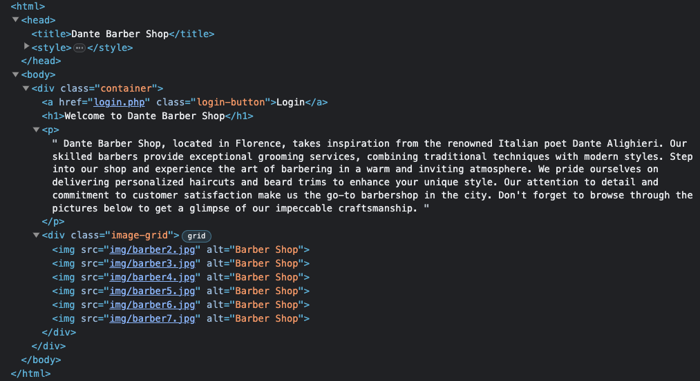
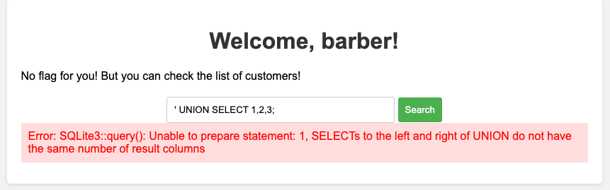
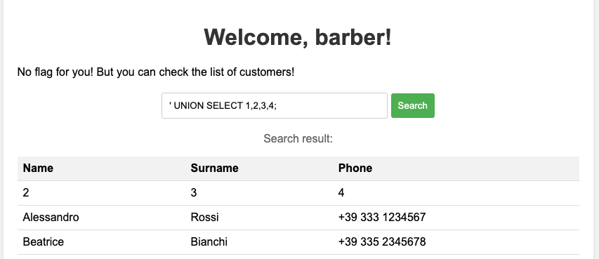

---

## Exploration

Dante's Barber Shop website greets us with a short text and some pictures about their work. The login button in the upper right also immediately catches attention.


However, there doesn't seem to be an easy way to bypass the login: `admin:admin` doesn't work and a basic SQL injection also only leads to "invalid username and password". Thus, let's explore the site a little further.

Opening the developer console and having a look at the site's source doesn't reveal anything surprising either. Nevertheless, we noticed that the six pictures on the site are numbered `barber2.jpg` to `barber7.jpg`. So, what about `barber1.jpg`?



As it turned out, a picture with this name exists on the web server, but it doesn't portray anything related to hair or beard. Instead, it shows a username (`barber`) and password for a backup user. Needless to say, these credentials work on the login form – we have successfully logged in!

## Road to the flag

But not so fast! There is no flag yet, only a seemingly boring list of customers and their phone numbers -- and a search field to filter the list.


This downright screams "SQL injection"! A list like this is the perfect fit for SQL's `UNION` keyword. It simply takes whichever `SELECT` statement comes afterwards and appends its result to the query result of the first `SELECT`. The important thing hereby is that the number of columns of both results needs to match, otherwise SQL won't be able to process the query. This is exactly what happened on the first attempt to select and union some constant values. Since the table shows three columns, our first attempt was

```sql
' UNION SELECT 1, 2, 3;
```

which didn't work as expected, but fortunately produced this wonderful error message:




---


Internally, the SQL statement to get the customer list most likely looks something like this:
```sql
SELECT * FROM customers WHERE name = '$name';
```
where `$name` is the variable where the user's search text will be inserted by the backend code. This, of course, is vulnerable to an SQL injection.

in order to attack it, we first need a `'` (single quote) character to close the quotes surrounding the variable. Then we are able to write whatever SQL we want after it. This is the resulting query that the database will see:

```sql
SELECT * FROM customers WHERE name = '' UNION SELECT 1, 2, 3;
```


---

We quickly found out that the correct number of columns was four, most likely because the internal SQL statement simply selects all fields (`*`) including the `id` column, which is just not displayed on the site.



Now that we have an idea of how to print out data from the database, we only need to query it for something useful! Since we are currently logged in as the user `barber` (which doesn't really sound like an admin account), we might want to see if there are other users stored in the database. The most straightforward naming for such a table would be `users`, containing at least the columns `username` and `password`. Let's see if we are lucky:

```sql
' UNION SELECT 1, 2, username, password FROM users;
```


We are lucky! There is the user `barber` that we already know and an account with the username `admin`.

The only thing that's left is to use these credentials to login as the admin and voilà: there is our flag!


---

Shout-out and a thanks to my teammates [Jonas](https://github.com/jonas-hoebenreich/), [MrGameCube](https://github.com/mrgamecube) and all others!

---