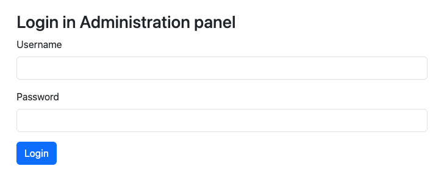
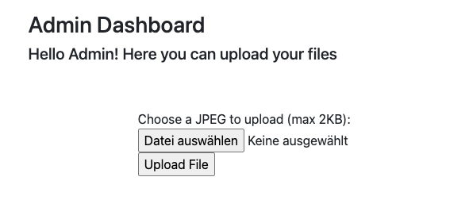
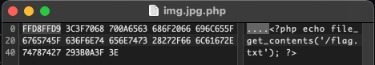

---

The "Dumb Admin" challenge description states:

> The Admin coded his dashboard by himself. He's sure to be a pro coder and he's so satisfied about it. Can you make him rethink that?

Let's see what we are tasked with here.



## Login OR 1=1

The Admin dashboard only consists of a simple login form, there's nothing more to discover here. As always, we started with the basics and the credentials `admin:admin`, but the only thing we get is an error telling us "Invalid password format"[^1]. Other default credentials don't seem to work either, so let's see if there is any luck with SQL injection.

We choose the following SQL snippet as the username, together with some arbitrary password.
```sql
' OR 1=1; --
```

Success! We have logged in without knowing any valid credentials.

---

In order to craft a successful SQL injection string, we have to think about how the statement might look in the vulnerable code. In this case, we imagine it to be something like this:
```sql
SELECT * FROM users WHERE username = '$username' AND password = '$password';
```
with `$username` and `$password` being the variables that fill in the user-provided values. The login is successful, if there is at least one row returned in the query result.

Our goal now is to modify the query string that the SQL engine will see in such a way that it definitely returns one result or more. Inserting our snippet from above, the query becomes the following:
```sql
SELECT * FROM users WHERE username = '' OR 1=1; --' AND password = '$password';
```
The leading single quote character (`'`) closes the quotes of the username string and the `OR 1=1` part ensures that the result of the `WHERE` clause always evaluates to true. We end the SQL statement with a semicolon (`;`) and comment out the rest of the statement that is left in the code with two hyphens (`--`).




---

## File upload



The dashboard looks quite empty. The only thing that we're able to do is to upload files. According to the text on the page, it only accepts JPEG images with up to 2 KB. Let's quickly explore how the page works if we use it as intended.

Since 2 KB is not very large for a JPEG image, we needed to be creative with which picture to choose. I decided to simply cut out a tiny piece from a photo that I had laying around and made sure it is small enough. I named the file `img.jpg` and uploaded it. As expected, this process works and we are presented with this sucess message:

> The image 704073e3b13582dd38ecbed0d6af8859.jpg has been uploaded!
You can view it here: [Click here]()

Seemingly, the file is being renamed to a harmless name in the process.

Now let's explore if the upload form really only accepts JPEG images. We first tried to upload a PHP file, but it the site tells us that the extension ".php" doesn't indicate an image file. Next, we checked whether the page only looks at the file extension, so we created a regular text file and named it `img.jpg`. Again, the file is not accepted, as it "seems to be not a real image". This indicates that the backend code checks for the file extension as well as its content and really only accepts valid JPEG files. Too bad for us, but as we'll see later, that's not the end of the story.

But first, let's go further with our successfully uploaded file. Clicking the link from the success message brings us to a page that renders the picture. We made a few observations on that page:
1. The URL for this particular image is `/imageViewer.php?filename=704073e3b13582dd38ecbed0d6af8859.jpg`
2. The page tells us that the image exists
3. The server is capable of executing PHP scripts

Our first thought here was: "Can we maybe access other files on this server?" – the `?filename=` parameter looks suspicious. A simple choice for a file to look for is the `flag.txt` file, which is – according to the CTF's rules – always found in the server's root directory, i.e. `/flag.txt`.

After some failed attempts, we found the correct number of directories to go up and the page confirmed that the file exists: `?filename=../../../../flag.txt`

However, we can't simply print out the contents of the file, since the only thing that the page does in order to render the image is to put the filename in the `src` attribute of an `img` tag and let the browser interpret it. Manually accessing the path, for example, via `curl` doesn't seem to work. So, we have to find another way.

## Connecting the dots

Until now, we know a few things:
1. The upload only accepts images that are valid JPEG files
2. There site provides us no native way to read the contents of a file on the server
3. If not configured otherwise, PHP only ever executes files that have the extension `.php`

This means that we would somehow need to upload a file that looks like a valid JPEG file to the upload code, but looks like PHP to the server. Suddenly, a thought came up in my mind:

> Does the upload form really look for the file extension? Or does it just enforce that the filename contains `.jpg` somewhere?

To answer this question, I took the (valid) `img.jpg` file from earlier and simply renamed it to `img.jpg.txt`, uploaded it and – success!

## The magic of JPEG and PHP

It's time to craft a script that finally outputs our flag. The PHP part of it is rather straightforward:
```php
<?php
    echo file_get_contents('/flag.txt');
?>
```

Now we only need to modify the file such that it is identified as a JPEG image. Most programs use so-called [magic bytes](https://en.wikipedia.org/wiki/Magic_number_(programming)#In_files) in order to identify a file type. A JPEG image file always begins with `FF D8` and ends with `FF D9`. We use a simple [hex editor](https://github.com/HexFiend/HexFiend) to insert these bytes before our PHP script and save it as `img.jpg.php`.



Since PHP ignores anything that comes before `<?php` or after `?>` (or more specifically: treats it as plain HTML), these bytes don't interfere with any of PHP's execution.

We can finally upload our file and click the link in the success message to view the "image" on the `imageViewer.php` page. Of course, the browser can't render our fake image, so we need to manually visit the `img` tag's source, and there is our flag!

---
Shout-out and a thanks to my teammates [Jonas](https://github.com/jonas-hoebenreich/), [MrGameCube](https://github.com/mrgamecube) and all others!

[^1]: We discovered that there is some kind of check to the password, if it fits certain password rules. Apparently, all passwords shorter than six characters is discarded as an "invalid password format". Wrong credentials with a longer password are rejected as "invalid credentials".